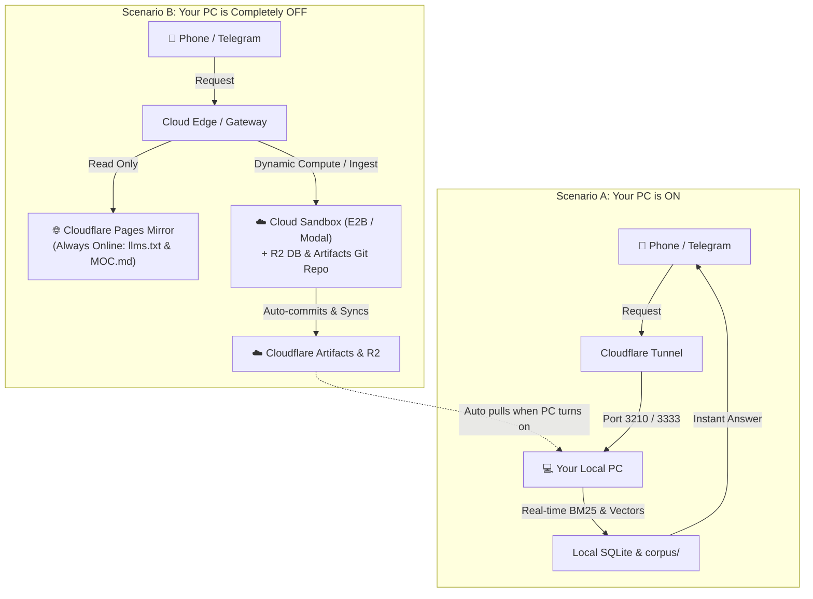

# Complete Implementation Plan: Autonomous Knowledgebase & Multi-Client Execution Engine

This document is the definitive master technical architecture, product blueprint, and implementation plan for transforming the **QMD Personal Knowledgebase** into a commercial-grade, one-click, self-contained **Autonomous Intelligence Platform & Desktop Application**.

---

## 1. Executive Product & Commercial Architecture

### Vision: The One-Click Self-Contained Desktop Product
The QMD Personal Knowledgebase is engineered as a commercial, local-first consumer and power-user software product. It provides a completely private, on-device second brain, hybrid semantic search engine, and autonomous agent harness that can be operated from a native desktop application, mobile devices, and external AI clients.

```
┌────────────────────────────────────────────────────────────────────────┐
│                        ONE-CLICK DESKTOP APP                           │
│                      (Tauri / Electron / Webview)                      │
│                                                                        │
│  ┌──────────────────────────────────────────────────────────────────┐  │
│  │   Desktop UI: Web Control Plane + Chat Console + Setup Wizard   │  │
│  └──────────────────────────────────┬───────────────────────────────┘  │
│                                     │ IPC / HTTP / RPC                 │
│                                     ▼                                  │
│  ┌──────────────────────────────────────────────────────────────────┐  │
│  │                     EMBEDDED LOCAL RUNTIMES                      │  │
│  │                                                                  │  │
│  │   ┌─────────────────────┐      ┌──────────────────────────────┐  │  │
│  │   │  Pi Agent Harness   │◄────►│   Control Plane & Daemons    │  │  │
│  │   │  (@earendil-works)  │      │   (:3333 Supervisor/Cron)    │  │  │
│  │   └──────────┬──────────┘      └──────────────┬───────────────┘  │  │
│  │              │                                │                  │  │
│  │              ▼                                ▼                  │  │
│  │   ┌─────────────────────┐      ┌──────────────────────────────┐  │  │
│  │   │ QMD Engine (:8181)  │      │ Local Silos & Inbox          │  │  │
│  │   │ (Hybrid Search/vec) │      │ (Disk: %APPDATA%/corpus)     │  │  │
│  │   └─────────────────────┘      └──────────────────────────────┘  │  │
│  └──────────────────────────────────────────────────────────────────┘  │
└────────────────────────────────────────────────────────────────────────┘
```

#### Key Commercial Principles:
1. **Elimination of Developer Dependencies**:
   - The end user does not need Python or Node.js pre-installed, does not open PowerShell, and never runs `npm install` or `git clone`.
   - The desktop installer bundles embedded runtimes (bundled Node.js + portable Python or PyInstaller binary). Double-clicking `QMD-Setup.exe` installs everything cleanly into `%APPDATA%/QMD` and launches silently in the system tray.
2. **First-Run Onboarding Wizard**:
   - A clean 3-step setup modal guides users on first launch:
     - *Step 1: Choose Storage Location* (Default: `Documents/QMD` or private AppData).
     - *Step 2: Choose AI Provider* (Option A: Enter OpenAI/Anthropic/Gemini key; Option B: Use 100% Free Cloudflare Workers AI tier; Option C: Use 100% Local offline models).
     - *Step 3: Connect Devices* (QR code for Mobile PWA, 1-click connect to Telegram bot or Claude Desktop).
3. **Self-Contained & Isolated**:
   - Each user has their own private SQLite database and file directory. No shared multi-tenant servers, zero cross-contamination.

---

## 2. Storage & Compute Hierarchy: Local-First Disk + Cloudflare Artifacts & R2

### Why GitHub Fails for Consumer / Commercial Knowledgebases:
1. **Hard Size Limits**: GitHub enforces a strict 100 MB per-file limit and a 2 GB to 5 GB recommended repository limit. A user with 20 PDF books or high-res document scans will breach Git quotas.
2. **Privacy Violations**: Asking non-technical customers to upload personal health notes, financial PDFs, or private journals to a GitHub repo is an unacceptable privacy barrier.
3. **User Friction**: End users do not have GitHub accounts, do not know what SSH keys or Personal Access Tokens (PATs) are, and should never be asked to generate a Git token.

### The Unified Cloudflare Hybrid Storage & Versioning Architecture:
Rather than relying on third-party Git hosts like GitHub, the system harnesses **Cloudflare Artifacts** and **Cloudflare R2** together:

```
┌─────────────────────────────────────────────────────────────────────────────┐
│                             USER'S LOCAL DISK                               │
│                         (Primary Source of Truth)                           │
│   - %APPDATA%/corpus/*.md (Markdown Units & Wiki Pages)                    │
│   - .qmd.db SQLite Indices (FTS5 BM25 + sqlite-vec Embeddings)              │
│   - 100% Offline, Instant Latency (<5ms), Complete Local Privacy            │
└───────────────────────┬─────────────────────────────┬───────────────────────┘
                        │                             │
    Git Protocol / Smart HTTP                         │ S3 Protocol / Multipart
    (Markdown & Wiki Versioning)                      │ (Binary & Vector DB Sync)
                        ▼                             ▼
┌──────────────────────────────────────────┐  ┌───────────────────────────────┐
│     CLOUDFLARE ARTIFACTS                 │  │    CLOUDFLARE R2 BUCKET       │
│  - Git-Compatible Edge Repositories      │  │  - 10 GB Free Storage Forever │
│  - Built on Cloudflare Durable Objects   │  │  - $0.00 Egress Bandwidth Fees│
│  - Native commits, diffs, log, revert    │  │  - Stores pre-computed .qmd.db│
│  - Programmatic API & Wrangler CLI       │  │  - Large raw PDFs & Media     │
│  - Designed specifically for AI agents   │  │  - AES-256-GCM Encrypted      │
└───────────────────┬──────────────────────┘  └───────────────┬───────────────┘
                    │                                         │
                    └────────────────────┬────────────────────┘
                                         │
                                         ▼
                     ┌─────────────────────────────────────────┐
                     │          EDGE ACCESS SURFACES           │
                     │                                         │
                     │  ┌──────────────────┐ ┌──────────────┐  │
                     │  │ Cloudflare Pages │ │ Dynamic      │  │
                     │  │ Static Mirror    │ │ Cloud        │  │
                     │  │ (24/7 Mobile/Web │ │ Sandboxes    │  │
                     │  │  llms.txt/MOC)   │ │ (When PC OFF)│  │
                     │  └──────────────────┘ └──────────────┘  │
                     └─────────────────────────────────────────┘
```

1. **Local-First Core (Primary Source of Truth)**:
   - Resides on the user's local drive (`%APPDATA%/corpus`).
   - Hybrid Search: QMD engine (BM25 FTS5 + local GGUF embeddings via `sqlite-vec` + cross-encoder rerankers).
   - 100% private, zero-latency, operates completely offline without internet connection.
2. **Cloudflare Artifacts (Git-Compatible Versioned Storage for AI Agents & Text)**:
   - Cloudflare's new Git-compatible storage service built on Durable Objects.
   - Speaks standard Git smart HTTP protocol. Every repository can be cloned, fetched, committed to, and pushed to using standard Git CLI or programmatic APIs.
   - Gives users and autonomous agents full **Git superpowers (commit history, branching, diffs, and reverts)** completely hosted on Cloudflare—with **zero dependency on GitHub**.
   - Accessible via short-lived scoped tokens; supports instant edge forking and on-the-fly mounting via **ArtifactFS**.
3. **Cloudflare R2 (Binary & Database Object Store)**:
   - **10 GB Free Storage** every month with **$0.00 egress bandwidth fees forever**.
   - Stores large binary assets (PDF document drops, audio files) and pre-indexed `.qmd.db` SQLite snapshots.
   - **Pre-computed `.qmd.db` Replication**: When a Cloud Sandbox boots up, it downloads `.qmd.db` from R2 in <1s. Vector embeddings are **never recomputed on the fly** for existing documents.
4. **Cloudflare Pages Static Mirror (`qmd-mirror.pages.dev/<TOKEN>/`)**:
   - Read-only static edge deployment. Hosted globally on Cloudflare's CDN edge.
   - Serves the token-gated Map of Content (`MOC.md`), synthesized concept pages, and raw units.
   - **Online 24/7/365**, accessible from any smartphone, tablet, or browser even when the host PC is powered off.

---

## 3. Comprehensive Architectural Analysis: Feature 7 Foundations

### Question 1: Is the Cloudflare Edge Mirror (`https://qmd-mirror.pages.dev/<MIRROR_TOKEN>/`) a Valid Entry Point?

**Yes, absolutely.** In fact, it is the most resilient entry point in the entire system.

* **What it is**: In Stage 4, we deployed `qmd-mirror` to Cloudflare Pages. It hosts your token-protected `llms.txt` (the global map of all files and topics) and pre-rendered markdown pages (like `MOC.md`).
* **Why it was listed separately**: Other entry points (Claude.ai, Telegram, Web Control Plane, Custom GPTs) are **active compute entry points** (running live searches, reasoning, and code). The Cloudflare Mirror is a **zero-compute static edge entry point**.
* **Why it is so powerful**: Because it is hosted globally on Cloudflare’s CDN edge, **it is online 24/7/365, even if your laptop is unplugged, powered off, or on an airplane.** Any browser, mobile phone, or AI model that can fetch web links can read from it at any moment.

---

### Question 2: Are Gateways One-Way or Full Two-Way? And How Do You Access Files When the Host Device is Switched OFF?

#### 1. Are they one-way or two-way?
They are **full two-way interactive systems**:
* **Send (Ingest)**: You can drop a YouTube link, tweet, PDF, or voice note to the gateway, and it saves it into `corpus/`.
* **Receive (Search & Ask)**: You can query your knowledgebase (`/search`, ask questions, summarize), and the gateway retrieves the exact excerpts with citation links and answers back.

#### 2. How does file access work when your laptop/PC is switched OFF?
Two distinct physical realities exist:



* **When your PC is ON**: The request travels through the Cloudflare Tunnel directly to your local Python process and SQLite database. Everything runs on your machine with zero cloud compute cost.
* **When your PC is OFF**: Your physical machine cannot respond. Access in this state relies on two fallback mechanisms:
  1. **For Reading / Referencing**: The **Cloudflare Pages Mirror** (`qmd-mirror.pages.dev/<TOKEN>/`) remains live. It holds the pre-compiled corpus and `llms.txt`.
  2. **For Executing New Tasks / Searches**: The request routes to the **Cloud Sandbox (Feature 6)**—an ephemeral microVM (like E2B or Modal) that pulls the latest files from Cloudflare Artifacts and pre-indexed `.qmd.db` from Cloudflare R2, executes the search or ingestion, commits the change to Cloudflare Artifacts, and syncs back to your PC when turned on.

---

### Question 3: Did We Merge a Full Agent Harness, or Cherry-Pick Components?

**In Features 1–6, we cherry-picked and adapted isolated patterns. In Feature 7, we embed the FULL Pi-Agent monorepo (`earendil-works/pi`).**

* In Features 1–6:
  - From Hermes: We adapted progressive tool calling and the scheduler.
  - From Agent-Reach: We adapted multi-channel extractors.
  - From LiteParse: We hooked up PDF OCR in `connectors/pdfs.py`.
* **In Feature 7**: Per explicit architectural alignment, we embed the **complete, full Pi Agent monorepo** (`earendil-works/pi`) from `potential-Autonomous-Intelligence-Execution Engine/pi-main` directly into `engine/pi`. This equips the knowledgebase with full agent autonomy, multi-turn reasoning, streaming JSON-RPC, and self-correction.

---

### Question 4: How Does the Telegram/Discord Bot Gateway Work When the Device is Switched OFF?

* **Local Mode (Default)**: Runs as a background daemon inside `control_plane/server.py` on your machine.
* **Cloud/Edge Webhook Mode**: A lightweight script (or Cloudflare Worker) that receives Telegram webhooks, reads from the Cloudflare Pages mirror and R2 bucket, and routes compute tasks to Cloud Sandboxes when your laptop is asleep.
* **Feature Parity**: The bot exposes commands matching the Web Control Plane: `/search`, `/get`, `/ingest`, `/status`, and `/run` (autonomous agent tasks).

---

### Question 5: Does the ChatGPT OpenAPI Gateway Have Full Features? And What About ChatGPT "Plugins"?

#### 1. What happened to ChatGPT "Plugins"?
* **ChatGPT Plugins are completely dead.** OpenAI officially shut down and deprecated the entire Plugins platform in April 2024.
* In their place, OpenAI introduced **Custom GPTs with GPT Actions**:
  - Instead of proprietary plugins, GPT Actions use standard **OpenAPI 3.0 / 3.1 specifications**.
* By providing `control_plane/openapi.json` alongside our MCP server, we support both:
  - **Claude.ai / Cursor / Antigravity**: Connect natively via MCP (`:8181`).
  - **ChatGPT / Custom GPTs**: Connect natively via GPT Actions (OpenAPI specification on `:3210`).

#### 2. Does the ChatGPT gateway have full features?
Yes. The OpenAPI specification defines endpoints for search, retrieval, status checking, and URL ingestion. ChatGPT reads this specification and decides which action to call based on your natural language prompt.

---

### Question 6: Is a "DAG" What Modern Coding and AI Agents Actually Use?

**No. Modern autonomous AI agents (Hermes, Claude Code, Codex, Pi, Amp) do NOT use rigid DAGs.**

#### How Modern AI Agents Actually Run Workflows:
1. **Airflow / n8n / Dify (Old/Deterministic Paradigm = DAG)**:
   - Rigid flowcharts: `[Step 1]` ➡️ `[Step 2]` ➡️ `[Step 3]`.
   - If an unexpected error occurs (e.g. rate limit, layout change), the static flowchart breaks.
2. **Claude Code / Hermes / Codex / Pi (Modern Agent Paradigm = ReAct Goal-Driven Loop)**:
   - Dynamic Reasoning & Tool-Execution Loop:
     ```mermaid
     flowchart LR
         Goal["User Prompt / Goal"] --> Reason["1. Reason & Plan"]
         Reason --> ToolChoice["2. Choose Tool from Catalog"]
         ToolChoice --> Execute["3. Execute Tool & Observe Result"]
         Execute --> Evaluate{"4. Goal Achieved?"}
         Evaluate -- No / Error --> Reason
         Evaluate -- Yes --> Done["5. Final Answer"]
     ```
   - **Why this is superior**: If a tool fails, the model observes the error output, adjusts its plan, tries an alternative tool, and self-corrects without requiring a pre-drawn failure branch.

#### What Hermes, Claude Code, and Pi Actually Use Instead of a DAG:
* **Hermes Agent**: Uses `conversation_loop.py` + `turn_tool_round.py` driven by Skills (`SKILL.md`).
* **Claude Code**: Uses a prompt-driven execution loop with tool calling and subagent dispatching.
* **Pi**: Uses an interactive, event-driven agent loop with tool streaming, durable sessions, and JSON-RPC.

---

### Difference Summary: Execution vs. Static Reading

1. **Cloudflare Pages Mirror is Read-Only**: A static website. Cannot run code, cannot download a YouTube video, cannot transcribe audio with Whisper, cannot scrape a new tweet, and cannot write new files.
2. **Cloud Sandbox is an Active Compute Engine**: When you send a link from your phone on the subway, it boots up, downloads the video, runs Whisper, extracts concepts with an LLM, creates the new markdown file, and updates R2 and Artifacts.
3. **No Wasteful Vector Recomputation**: By replicating the pre-indexed `.qmd.db` (containing `sqlite-vec` embeddings) to R2, the cloud sandbox hydrates the entire vector database in <1s, avoiding repeated on-the-fly embedding computations.

---

## 4. Technical Solutions to Core User Inquiries

### 1. LiteParse Official Binary Integration
- **Binary Installation**: Install the official pre-compiled Windows AMD64 wheel (`liteparse-2.14.6-cp310-abi3-win_amd64.whl`), which bundles the compiled C PDFium engine and `lit.exe` CLI.
- **Python Usage**: `from liteparse import LiteParse` is 100% sufficient for all production use cases.
  - Automatically reconstructs spatial layout and reading order.
  - Converts tabular data into Markdown tables.
  - Generates explicit page breaks `-----`.
  - Supports selective OCR for scanned documents.

### 2. Cloudflare Models for Reranker and Query Expansion
- **Reranker**: `@cf/baai/bge-reranker-base` (and `@cf/baai/bge-reranker-large`).
- **Query Expansion**: `@cf/meta/llama-3.1-8b-instruct-fp8-fast` (and ultra-low latency `@cf/meta/llama-3.2-3b-instruct`).

### 3. The 3-Tier Operational Mode Toggle
A unified, user-configurable setting in Control Plane UI and `.env`:
1. **`offline-only`**: 100% on-device. Uses local QMD + local GGUF models (`embeddinggemma-300M`, `qwen3-reranker-0.6b`) + local Pi Agent + local SQLite. Zero remote calls.
2. **`offline+cloudflare-wiki`**: Local search and local Pi execution, plus Cloudflare Workers AI for Wiki synthesis (`scripts/wiki.py`) and Cloudflare Pages Mirror deployment. Sandboxes remain local.
3. **`full`**: Everything enabled: Local QMD + Cloudflare Wiki + Cloudflare Artifacts & R2 Sync + Cloud Sandboxes + Remote Bot Gateways.

### 4. Cloudflare Free-Tier Stateful Storage
- **Cloudflare Artifacts**: Git-compatible versioned repository for Markdown units and Wiki state. Provides full commit histories, branching, and rollbacks without GitHub.
- **Cloudflare R2**: 10 GB free forever, $0 egress fees. Stores large binary files and pre-indexed `.qmd.db` snapshots.
- **Cloudflare Vectorize**: 5 million free queries/month, 100k vector dimensions stored free.
- **Cloudflare D1**: 5 GB free serverless relational SQLite database at the edge.

### 5. Full Pi-Agent Embedding (`earendil-works/pi`)
- Move and embed the complete 12-package monorepo into `engine/pi`:
  - `@earendil-works/pi-coding-agent` (CLI, TUI, RPC mode)
  - `@earendil-works/pi-agent-core` (agent runtime, tool runner)
  - `@earendil-works/pi-ai` (multi-provider LLM API)
  - `@earendil-works/chord`, `@earendil-works/pi-durable`, `@earendil-works/pi-tui`, telemetry, protocol, client, server.
- Supervised by Control Plane via stdio JSON-RPC (`pi --mode rpc`).

### 6. Cloudflare Artifacts Versioned File System & Rollbacks
- Cloudflare **Artifacts** is Cloudflare's new dedicated Git-compatible versioned storage system:
  - Every repository is an edge-native Git remote backed by Durable Objects.
  - Standard Git operations work out of the box (`clone`, `push`, `pull`, `diff`, `log`, `revert`).
  - Managed programmatically via Wrangler (`npx wrangler artifacts repos create`) or REST API.
  - Allows the knowledgebase to maintain an immutable, auditable, and revertible version history for all user notes and agent edits without requiring a GitHub account!

---

## 5. Complete Inventory of All Models Across the Knowledgebase

| Model URI / Identifier | Location / Runtime | Function in Knowledgebase | Resource Footprint | Performance & Accuracy Trade-offs | Storage / Sync Method |
| :--- | :--- | :--- | :--- | :--- | :--- |
| **`embeddinggemma-300M-Q8_0.gguf`** | Local Laptop (`node-llama-cpp`) | Vector embeddings for markdown chunks (768 dimensions) | ~320 MB RAM | High speed (<15ms/chunk on CPU). High accuracy for English and code retrieval. | Downloaded locally via `qmd pull` into local cache. |
| **`qwen3-reranker-0.6b-q8_0.gguf`** | Local Laptop (`node-llama-cpp`) | Cross-encoder reranking of candidate chunks from BM25 + Vector | ~650 MB RAM | Highest precision: jointly scores query + chunk. Takes ~150ms per 10 candidates. Disabled in `cpu-only` mode. | Downloaded locally via `qmd pull`. |
| **`qmd-query-expansion-1.7B-q4_k_m.gguf`** | Local Laptop (`node-llama-cpp`) | Query Expansion (generates search synonyms and sub-queries) | ~1.1 GB RAM | Improves recall on vague questions; adds ~300ms latency. Optional. | Downloaded locally via `qmd pull`. |
| **`whisper` (base/small)** | Local Laptop (PyTorch / CTranslate2) | Transcribes YouTube videos and audio files in `connectors/agent_reach.py` | ~250 MB RAM | Offline, free, 1-2x realtime on CPU. Good accuracy for clear speech. | Local PyTorch weights cache. |
| **`@cf/meta/llama-3.1-8b-instruct-fp8-fast`** | Cloudflare Workers AI (Edge API) | Karpathy LLM-Wiki topic synthesis (`scripts/wiki.py`), query expansion | Zero local RAM (Serverless) | Fast (<1.2s/page), 128k context, free tier (10k Neurons/day). High conceptual synthesis quality. | Cloud-hosted; called via HTTPS. |
| **`@cf/baai/bge-base-en-v1.5`** | Cloudflare Workers AI (Edge API) | Cloud-side semantic vector embeddings for Cloud Sandboxes | Zero local RAM (Serverless) | Top-tier MTEB retrieval benchmark score, ~25ms API latency. Zero cold-start. | Cloud-hosted; called via HTTPS. |
| **`@cf/baai/bge-reranker-base`** | Cloudflare Workers AI (Edge API) | Cloud-side cross-encoder reranker for candidate scoring | Zero local RAM (Serverless) | High precision scoring without downloading local cross-encoders; ~40ms latency. | Cloud-hosted; called via HTTPS. |
| **`@cf/openai/whisper`** | Cloudflare Workers AI (Edge API) | Cloud-side audio transcription fallback | Zero local RAM (Serverless) | Transcribes 30-minute audio files in 4 seconds in the cloud. | Cloud-hosted; called via HTTPS. |
| **`claude-3-7-sonnet` / `claude-3-5-sonnet`** | Anthropic API / Claude Desktop | High-level autonomous reasoning, complex coding, deep research | Zero local RAM | Industry state-of-the-art coding and agentic reasoning; paid per token. | External client connector via MCP (`:8181`). |
| **`gpt-4o` / `gpt-4o-mini`** | OpenAI API / Custom GPTs | Custom GPT Actions reasoning brain | Zero local RAM | Fast tool execution, native OpenAPI 3.1 action calling; paid per token. | External client connector via Auth Proxy (`:3210`). |

---

## 6. Feature Execution Status (Features 1–6 Completed & Verified)

* **Feature 1: Engine Retrieval Mode Toggle (`cpu-only` vs `full`)**: [COMPLETED & VERIFIED] — Commit `e33c359`.
* **Feature 2: Silo-Scoped Search in Web Control Plane**: [COMPLETED & VERIFIED] — Commit `e33c359`.
* **Feature 3: System Prompt & User Customization Engine (`SOUL.md` + `SYSTEM_PROMPT.md`)**: [COMPLETED & VERIFIED] — Commit `8306cfe`.
* **Feature 4: Comprehensive Connectors Ecosystem (Agent-Reach Channels)**: [COMPLETED & VERIFIED] — Commit `af0a8e0`.
* **Feature 5: Progressive Tool Calling & Skill Disclosure (Hermes 3-Tier Pattern)**: [COMPLETED & VERIFIED] — Commit `82d2a7c`.
* **Feature 6: Server-Side Crons, Automations & Sandboxes**: [COMPLETED & VERIFIED] — Commit `03c5745`.

All 133 automated regression tests passing (100% green).

---

## 7. Concrete Implementation Specification: Feature 7

### Component 1: Embedded Pi-Agent Harness (`engine/pi`)
1. Promote `potential-Autonomous-Intelligence-Execution Engine/pi-main` into `engine/pi` within the repository.
2. Build `control_plane/pi_bridge.py`:
   - Spawns `node engine/pi/packages/coding-agent/dist/bundle/rpc-entry.js --mode rpc` (or via `tsx`).
   - Handles two-way JSON-RPC over stdio.
   - Registers QMD tools (`qmd_search`, `qmd_vsearch`, `qmd_get`, connector fetchers, and sandbox scripts).
   - Injects `SOUL.md` and `SYSTEM_PROMPT.md` as Pi's root instructions.
   - Streams intermediate events (tool calls, thoughts, errors, output) to callers.

### Component 2: Cloudflare Artifacts & R2 Sync Engine (`sync/cloudflare_sync.py`)
1. Implement dual Cloudflare sync:
   - **Cloudflare Artifacts (Git Smart HTTP)**: Pushes/pulls Markdown files and Wiki state to an edge Git repository via Wrangler / Cloudflare API. Supports diffs and rollbacks natively.
   - **Cloudflare R2 (S3-Compatible)**: Uploads large binary files and the pre-computed `.qmd.db` SQLite snapshot.
2. **1-Click Sync**:
   - Single command / button in Control Plane: syncs git commits to Cloudflare Artifacts and vector database snapshots to Cloudflare R2.
   - Includes rollback endpoint `POST /api/sync/revert`.

### Component 3: 3-Tier Operational Mode Controller
1. Update `control_plane/server.py`:
   - Support `OPERATIONAL_MODE` (`offline-only`, `offline+cloudflare-wiki`, `full`) in `.env` and via `POST /api/engine/operational-mode`.
   - In `offline-only`, block all outbound calls to Cloudflare Workers AI, Artifacts, R2, and Cloud Sandboxes.
2. Update Control Plane UI (`index.html` & `app.js`):
   - Add an interactive 3-Tier Mode Selector Card in Section 1 with live visual indicators.

### Component 4: Official LiteParse Binary Integration
1. Install pre-compiled wheel: `pip install liteparse`.
2. Update `connectors/pdfs.py`:
   - Wire `from liteparse import LiteParse` directly into `_default_parse(pdf_path)`.
   - Return clean Markdown with tables, headings, and page separators.

### Component 5: Multi-Client Autonomous Gateways & Task Console
1. **`gateways/bot_gateway.py`**:
   - Two-way Telegram bot adapter and Discord bot adapter.
   - Exposes `/search`, `/get`, `/ingest`, `/status`, and `/run <task>`.
   - Powered by the embedded Pi-Agent harness.
2. **`control_plane/openapi.json`**:
   - OpenAPI 3.1 specification for Custom GPT Actions.
3. **Web Task Console in Control Plane UI**:
   - Interactive task runner in `index.html`.
   - Real-time streaming log displaying Pi's thought process, tool calls, and output.

---

## 8. Verification Plan

### Automated Tests
1. **Pi-Agent Bridge Tests (`tests/test_pi_bridge.py`)**:
   - Test JSON-RPC process lifecycle, tool schema registration, and prompt execution.
2. **Cloudflare Sync & Artifacts Tests (`tests/test_cloudflare_sync.py`)**:
   - Test Cloudflare Artifacts Git remote sync, R2 binary uploads, versioned history tracking, and rollback logic.
3. **3-Tier Mode Tests (`tests/test_operational_modes.py`)**:
   - Test toggling between `offline-only`, `offline+cloudflare-wiki`, and `full`, asserting proper network gating.
4. **LiteParse PDF Ingestion Tests (`tests/test_pdfs_liteparse.py`)**:
   - Test parsing sample PDF documents into structured Markdown with page splits and tables.
5. **Gateway & OpenAPI Tests (`tests/test_gateways.py`)**:
   - Validate OpenAPI 3.1 schema correctness and Telegram bot command dispatching.
6. **Full Regression Suite**:
   - Run all 133 existing tests + new test suite and verify 100% green pass rate.

### Manual & Visual Verification
1. Drop a PDF into `inbox/pdfs/` and verify clean Markdown Unit generation via LiteParse.
2. Toggle between `offline-only`, `offline+cloudflare-wiki`, and `full` in the Web Control Plane.
3. Trigger an autonomous research goal in the Task Console and observe real-time streaming from the embedded Pi Agent.
