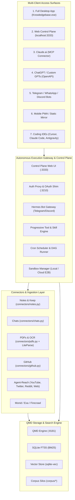

# Complete Implementation Plan: Autonomous Knowledgebase & Multi-Client Execution Engine

This document specifies the end-to-end technical architecture, system design, and implementation plan for transforming the **QMD Personal Knowledgebase** into a full-fledged **Autonomous Intelligence and Multi-Client Execution Platform**.

---

## 1. System Overview & Architecture

The platform operates across three interconnected layers:
1. **Core Data & Knowledge Storage**: QMD SQLite database (FTS5 BM25 + Vector embeddings) with siloed markdown repositories under `corpus/` (`notes`, `wiki`, `github`, `chats`, `pdfs`, `web`, `twitter`).
2. **Autonomous Execution Gateway & Control Plane**: A unified Python backend running the Web Control Plane (`:3333`), Auth Proxy & OAuth Shim (`:3210`), MCP Server Gateway (`:8181`), Hermes-inspired bot gateway, background scheduler, and sandbox runner.
3. **Multi-Client Access Surfaces**: Seven distinct clients ranging from desktop executables to thin mobile chat bots and coding IDEs.



---

## User Review Required

> [!IMPORTANT]
> **Key Architecture Decisions for Review:**
> 1. **Desktop App Technology**: Packaging the existing Control Plane frontend using **Tauri / Electron** into a standalone `.exe` so the desktop app and web dashboard share 100% of their UI and styling without design drift.
> 2. **Execution Engine Base**: Using the **Python-native Hermes architecture** embedded directly into the Control Plane for thin clients (Claude.ai, Telegram, WhatsApp) to eliminate Node/Python runtime impedance.
> 3. **Connector Integration**: Directly integrating [`Agent-Reach-main`](file:///c:/Users/rotim/Documents/QMD%20powered%20Personal%20Knowledgebase%20and%20Search%20Engine/Agent-Reach-main) into `connectors/` for YouTube transcripts, Twitter/X, Reddit, and authenticated browser scraping.
> 4. **Cloud Sandbox Provider**: Supporting **E2B microVMs** or **Modal** as the optional cloud fallback when long-running jobs are triggered while the local PC is shut down.

---

## Open Questions

> [!NOTE]
> 1. For cloud sandboxing (when running tasks while the local computer is shut down), do you prefer an **E2B API key** (ephemeral Linux microVMs in the cloud) or an **always-on VPS/server**?
> 2. For the Telegram bot token, would you like the bot setup wizard integrated directly into the Control Plane Settings tab?

---

## Proposed Changes by Feature Area

---

### Feature 1: Engine Retrieval Mode Toggle (`CPU-only` vs. `Full`) — [COMPLETED & VERIFIED]

Allow users to switch between lightning-fast BM25 retrieval (<2s on CPU) and full semantic reranking with vector batching (intended for GPU/high-spec machines).

* **Status**: Completed & Verified (Commit verified with full test suite passing 100/100).
* **Changes**:
  - `auth_proxy/server.py`: Checks `RETRIEVAL_MODE`; in `cpu-only` defaults MCP queries to `rerank: false`.
  - `qmd-main/src/store.ts` & `scripts/patch_qmd.py`: `isCpuOnly` environment check gates the FTS5 OR fallback and skips slow LLM query expansion and dense vector embeddings on CPU.
  - `control_plane/server.py`: Added `POST /api/engine/mode` endpoint, injects `RETRIEVAL_MODE` into child daemons, and reports status via `/api/status`.
  - `control_plane/static/index.html` & `app.js`: Added interactive Engine Retrieval Mode card with live status badge and instant mode toggling buttons.

---

### Feature 2: Silo-Specific Scoped Search — [COMPLETED & VERIFIED]

Enable precise keyword and semantic querying scoped to individual corpus partitions.

* **Status**: Completed & Verified (Subprocess execution with `-c <silo>` verified).
* **Changes**:
  - `control_plane/server.py`: Updated `/api/search` handler to parse `silo` query parameter (`notes`, `wiki`, `github`, `chats`, `pdfs`, `web`, `twitter`), pass `-c <silo>` to QMD CLI, and return silo metadata.
  - `control_plane/static/index.html` & `app.js`: Added silo dropdown selector directly in the Interactive Search Tester with full silo breakdown (`All Silos`, `Notes`, `Wiki`, `GitHub`, `AI Chats`, `PDFs`, `Web`, `X / Twitter`).
  - `tests/test_control_plane.py`: Added automated test suite coverage for silo parameter forwarding and mode switching.

---

### Feature 3: System Prompt & User Customization Engine (Thin-Client Support) — [COMPLETED & VERIFIED]

Give thin clients (Claude.ai, ChatGPT, Telegram, mobile) full access to personal rules, personas, tone guidelines, and directory-specific constraints without needing an IDE.

* **Status**: Completed & Verified (Live MCP `initialize` injection, `prompts/list`, `prompts/get`, and Control Plane API verified; 106/106 tests green).
* **Changes**:
  - `SOUL.md`: Persona definition, direct tone principles, anti-sycophancy, and conciseness rules.
  - `SYSTEM_PROMPT.md`: 7-silo corpus architecture, retrieval protocol, citation conventions, and truth grounding.
  - `auth_proxy/prompt_engine.py`: Synthesizes `SOUL.md` + `SYSTEM_PROMPT.md` + `AGENTS.md` + dynamic silo stats; implements MCP prompt templates (`knowledge-search`, `wiki-synthesis`, `deep-investigation`).
  - `auth_proxy/server.py`: Intercepts MCP `initialize` to inject synthesized system instructions (5.2KB) and advertise `prompts` capability; handles `prompts/list` and `prompts/get` natively.
  - `control_plane/server.py`: Added `GET /api/prompts` and `POST /api/prompts` endpoints for live inspection and saving of prompts.
  - `control_plane/static/index.html` & `app.js`: Added "Persona & Prompts" modal with live tabs for `SOUL.md`, `SYSTEM_PROMPT.md`, live synthesized instructions preview, and MCP prompt templates list.
  - `tests/test_prompt_engine.py`: Added automated test suite for prompt loaders, synthesis, and MCP template generators.

---

### Feature 4: Comprehensive Connectors Ecosystem (Agent-Reach Channels) — [COMPLETED & VERIFIED]

Unify all ingestion sources into a standardized, one-click or automated pipeline.

```
connectors/
├── notes.py          # Simplenote & Keep ZIPs (Existing)
├── chats.py          # Claude.ai & ChatGPT exports (Existing)
├── pdfs.py           # PDFs & OCR extraction (Existing)
├── github.py         # Git repository cloning & tracking (Existing)
├── web.py            # URL scraping & clean Markdown (Existing)
└── reach.py          # Agent-Reach bridge: YouTube transcripts, Twitter, Reddit, GitHub, Web (NEW)
```

* **Status**: Completed & Verified (113/113 tests green; multi-channel routing, schema-locked UnitPayload writers, Control Plane trigger endpoints, and interactive UI card verified).
* **Changes**:
  - `connectors/reach.py`: Full Agent-Reach connector implementation. Supports YouTube video metadata + Whisper transcription, Twitter/X post & thread extraction, Reddit discussions, GitHub repos, and web articles via Jina Reader. Produces schema-compliant Units with 9-field YAML frontmatter, mandatory summary blockquote, and `# Title`.
  - `control_plane/server.py`: Added `GET /api/connectors` health probe and `POST /api/connectors/reach` (with aliases `/youtube`, `/twitter`, `/reddit`, `/web`, `/github`) to trigger instant ingestion from URLs.
  - `control_plane/static/index.html` & `app.js`: Added "Agent-Reach Connectors & URL Ingestion" section with channel dropdown, URL input, Whisper audio transcription toggle, live progress spinner, and clickable result badge.
  - `tests/test_reach_connector.py`: Added comprehensive 7-test suite for URL detection, channel extractors, mock payloads, and end-to-end file writing.
  - `tests/test_control_plane.py`: Added automated test coverage for `GET /api/connectors` and `POST /api/connectors/reach`.

---

### Feature 5: Progressive Tool Calling & Skill Disclosure (Hermes Pattern)

Eliminate token bloat and tool confusion in thin clients like Claude.ai and Telegram.

#### [NEW] [progressive_tools.py](file:///c:/Users/rotim/Documents/QMD%20powered%20Personal%20Knowledgebase%20and%20Search%20Engine/auth_proxy/progressive_tools.py)
* Implements the 3-tier disclosure model researched from Hermes:
  - **Tier 1 (Catalog)**: `skills_list` returns only names and short descriptions (<200 tokens total).
  - **Tier 2 (Activation)**: `skill_view(skill_name)` returns full `SKILL.md` instructions when needed.
  - **Tier 3 (Bridge Execution)**:
    - `tool_search(query)`: Finds relevant tools by keyword.
    - `tool_describe(tool_name)`: Returns exact input schema on demand.
    - `tool_call(tool_name, arguments)`: Dynamically executes the target tool on the server.

---

### Feature 6: Server-Side Crons, Automations & Sandboxes

Allow users to set up recurring knowledge syncs and long-running autonomous tasks that continue even when their personal computer is shut down.

#### [NEW] [scheduler.py](file:///c:/Users/rotim/Documents/QMD%20powered%20Personal%20Knowledgebase%20and%20Search%20Engine/control_plane/scheduler.py)
* Background daemon thread inside Control Plane.
* Evaluates cron expressions or interval timers against `automations.json`.
* Executes tasks locally or routes to sandboxes.
* Emits progress and execution logs into `SystemLogger`.

#### [NEW] [sandbox.py](file:///c:/Users/rotim/Documents/QMD%20powered%20Personal%20Knowledgebase%20and%20Search%20Engine/control_plane/sandbox.py)
* Dual-tier execution sandbox:
  - **Local Sandbox**: Docker / local isolated subprocess with timeouts and restricted disk access.
  - **Cloud Sandbox Handoff**: Connects to **E2B** or **Modal** cloud microVMs for long-running batch jobs initiated remotely (e.g. via Telegram when PC is asleep).
  - Synchronizes resulting markdown back to `corpus/` and pushes git/mirror updates.

#### [MODIFY] [index.html](file:///c:/Users/rotim/Documents/QMD%20powered%20Personal%20Knowledgebase%20and%20Search%20Engine/control_plane/static/index.html)
* Add an **"Automations & Crons"** tab:
  - Button-based schedule builder (no CLI typing).
  - Dropdown for Action: `[ Ingest Inbox | GitHub Sync | Re-index Embeddings | Deploy Mirror | YouTube Transcribe ]`.
  - Dropdown for Schedule: `[ Every 30 mins | Hourly | Daily at 02:00 | Custom ]`.
  - Dropdown for Execution: `[ Local Daemon | Cloud Sandbox (Off-PC) ]`.
  - Table of active schedules with toggle switch (ON/OFF), last run status, and next scheduled run.

---

### Feature 7: GUI Button-Based DAG / Decision Tree Workflow Engine

A visual pipeline builder to chain multiple tools and decision branches together.

#### [NEW] [workflow_engine.py](file:///c:/Users/rotim/Documents/QMD%20powered%20Personal%20Knowledgebase%20and%20Search%20Engine/control_plane/workflow_engine.py)
* Executes declarative directed acyclic graphs (DAGs) defined in `workflows/*.json`.
* Supports conditional evaluation (e.g. `if step.detect.is_scanned == true then step.ocr else step.text`).
* Exposes an MCP tool: `run_workflow(workflow_id, params)` for Claude.ai and Telegram bots.

#### [MODIFY] [index.html](file:///c:/Users/rotim/Documents/QMD%20powered%20Personal%20Knowledgebase%20and%20Search%20Engine/control_plane/static/index.html)
* Add a **"Visual Workflows"** tab:
  - Visual block canvas to build pipelines:
    - **Trigger Block**: File upload, Cron, or Webhook.
    - **Condition Block**: Check file type, size, or content keywords.
    - **Action Blocks**: Run OCR, Scrape URL, Summarize with LLM, Index into QMD, Send Telegram alert.
  - Visual run tracker showing live progress through the decision tree.

---

### Feature 8: Standalone Desktop Executable (`Knowledgebase.exe`)

The primary windowed desktop application.

#### [NEW] [desktop/](file:///c:/Users/rotim/Documents/QMD%20powered%20Personal%20Knowledgebase%20and%20Search%20Engine/desktop)
* Tauri / Electron packaging configuration.
* Embeds the Control Plane UI directly into a native Windows window.
* Automatically launches and supervises the local Python backend and QMD daemon on startup.
* System tray integration: keeps running in background with quick access to search and sync.

---

## Verification Plan

### Automated Tests
1. **Engine Mode Verification**:
   - Test toggle between `cpu-only` and `full`.
   - Verify `auth_proxy` parameter interception (`rerank: false` vs `rerank: true`).
2. **Silo Search Verification**:
   - Run scoped searches against `notes`, `chats`, and `wiki` collections and assert no bleed-through across silos.
3. **Connectors Verification**:
   - Test `Agent-Reach` integration on YouTube transcript extraction and Twitter thread fetching.
4. **Progressive Disclosure Verification**:
   - Verify `skills_list` payload is <500 bytes.
   - Verify `tool_search` finds deferred tools on demand.
5. **Scheduler & Workflow Tests**:
   - Validate cron execution, conditional DAG branching, and failure recovery.
6. **Full Suite Regression**:
   - Run `uv run --with pytest python -m pytest tests/` and assert 100% pass rate.

### Manual & End-to-End Verification
1. **Claude.ai Live Verification**:
   - Query `https://kb.parmeterai.space/mcp` from Claude.ai and verify sub-second response, silo filtering, and progressive tool invocation.
2. **Control Plane UI Verification**:
   - Test the visual schedule builder and verify a scheduled job runs without errors.
   - Test the visual DAG workflow runner with a test PDF.
3. **Desktop Executable Verification**:
   - Launch `Knowledgebase.exe` and confirm seamless UI rendering, status monitoring, and search.
